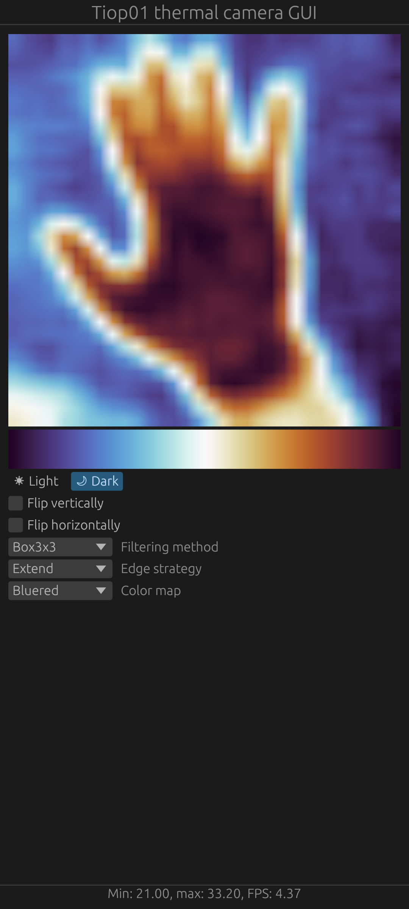

# tiop01-gui-android

## About
This is an Android version of https://github.com/dobo90/tiop01-gui. The code is based on https://github.com/rust-mobile/rust-android-examples/tree/3ad2b59852159fa98a33e1fd2575f0e89540ac6a/agdk-eframe.

## Compiling
Compile https://github.com/dobo90/tiop01-gui for Android. Then:
```
mkdir -p app/src/main/jniLibs/arm64-v8a
cp /path/to/tiop01-gui/target/aarch64-linux-android/debug/libmain.so app/src/main/jniLibs/arm64-v8a/libmain.so

gradle build
```

## Screenshot
